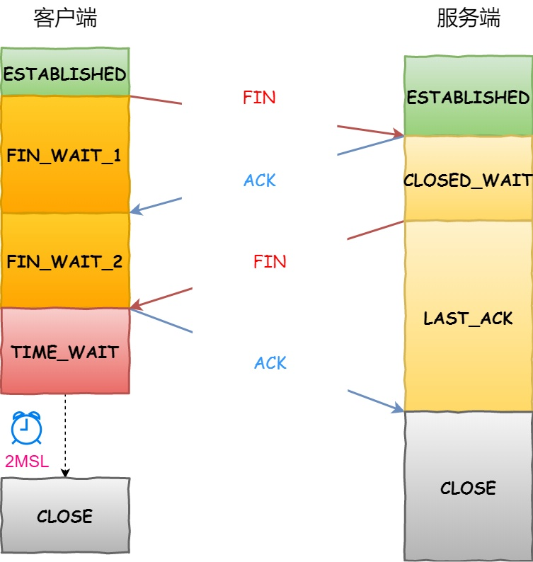

## js的基础类型与引用类型
- 基本数据类型：null，undefined，boolean，number，string，symbol
- 引用数据类型：对象类型Object type，比如：Object 、Array 、Function 、Data

## 如何对引用类型进行深拷贝（stringfy加上json.parse）其他的方式
```js
let a = {name:'zhangsan'}
let b = JSON.parse(JSON.stringify(a))
```
这种方法有局限性
+ 会忽略 undefined
+ 会忽略 symbol
+ 不能序列化函数
+ 不能解决循环引用的对象
```js
 var obj1 = {
    a: 1,
    b: 2,
    c: 3
}
var obj2 = Object.assign({}, obj1);
obj2.b = 5;
console.log(obj1.b); // 2
console.log(obj2.b); // 5
```
于一层对象来说是没有任何问题的，但是如果对象的属性对应的是其它的引用类型的话，还是只拷贝了引用，修改的话还是会有问题

## cookie和session
|  特性   | cookie  | localStorage | sessionStorage |
|  ----  | ----  | ---- | ---- |
| 数据生命周期  | 一般由服务器生成，可以设置过期时间 |除非被清理，否则一直存在 |页面关闭就清理 |
| 数据存储大小  | 4K | 5M | 5M |
| 与服务端通信  | 每次都会携带在 header 中，对于请求性能影响 | 不参与 | 不参与 |
## CSRF  
+ CSRF，即跨站请求伪造（英语：Cross-site request forgery）
+ 攻击者盗用了你的身份，以你的名义发送恶意请求。CSRF能够做的事情包括：以你名义发送邮件，发消息，盗取你的账号，甚至于购买商品，虚拟货币转账......造成的问题包括：个人隐私泄露以及财产安全。
+ 要完成一次CSRF攻击，受害者必须依次完成两个步骤：  
　　1.登录受信任网站A，并在本地生成Cookie。  
　　2.在不登出A的情况下，访问危险网站B。  
+ 例子：银行网站A，它以GET请求来完成银行转账的操作，如：http://www.mybank.com/Transfer.php?toBankId=11&money=1000
+ 危险网站B，它里面有一段HTML的代码如下：
```html

```
+ 首先，你登录了银行网站A，然后访问危险网站B，噢，这时你会发现你的银行账户少了1000块
+ 为什么会这样呢？原因是银行网站A违反了HTTP规范，使用GET请求更新资源。在访问危险网站B的之前，你已经登录了银行网站A，而B中的以GET的方式请求第三方资源（这里的第三方就是指银行网站了，原本这是一个合法的请求，但这里被不法分子利用了），所以你的浏览器会带上你的银行网站A的Cookie发出Get请求，去获取资源“http://www.mybank.com/Transfer.php?toBankId=11&money=1000” ，结果银行网站服务器收到请求后，认为这是一个更新资源操作（转账操作），所以就立刻进行转账操作
+ 如何防御？
    - Get 请求不对数据进行修改
    - 不让第三方网站访问到用户 Cookie
    - 阻止第三方网站请求接口
    - 请求时附带验证信息，比如验证码或者 token

## XSS
+ XSS ,即跨站脚本攻击，通过修改 HTML 节点或者执行 JS 代码来攻击网站
例如通过 URL 获取某些参数
```html
<!-- http://www.domain.com?name=<script>alert(1)</script> -->
<div>{{name}}</div>
``` 
+ 网页把用户通过GET发送过来的表单数据，未经处理直接写入返回的html流，这就是XSS漏洞所在
+ 如何防御？
最普遍的做法是转义输入输出的内容，对于引号，尖括号，斜杠进行转义

## function有变量提升吗？（函数提升）
```js
fn()    //123
console.log(fn)     //fn(){console.log('123')}
function fn(){
    console.log('123')
}
var fn = '456'
fn()    //456
```
```js
console.log(foo1); // [Function: foo1]
foo1(); // foo1
console.log(foo2); // undefined
foo2(); // TypeError: foo2 is not a function
function foo1 () {
    console.log("foo1");
};
var foo2 = function () {
    console.log("foo2");
};
```
- 函数提升只会提升函数声明，而不会提升函数表达式
## 跨域
+ JSONP
    + JSONP 的原理很简单，就是利用 \<script> 标签没有跨域限制的漏洞。
    + 通过 \<script> 标签指向一个需要访问的地址并提供一个回调函数来接收数据当需要通讯时。
    ```JS
    <script src="http://domain/api?param1=a&param2=b&callback=jsonp"></script>
    <script>
        function jsonp(data) {
            console.log(data)
        }
    </script>
    ```
+ CORS
    + 使用 CORS 的方式，CORS 是一个 W3C 标准，全称是"跨域资源共享"。
    + CORS 需要浏览器和服务器同时支持。目前，所有主流浏览器都支持该功能（IE 8 和 9 需要通过 XDomainRequest 来实现），因此我们只需要在服务器端配置就行。浏览器将 CORS 请求分成两类：简单请求和非简单请求。
    + 对于简单请求，浏览器直接发出 CORS 请求。具体来说，就是会在头信息之中，增加一个 Origin 字段。Origin 字段用来说明本次请求来自哪个源。服务器根据这个值，决定是否同意这次请求。对于如果 Origin 指定的源，不在许可范围内，服务器会返回一个正常的 HTTP 回应。浏览器发现，这个回应的头信息没有包含 Access-Control-Allow-Origin 字段，就知道出错了，从而抛出一个错误，ajax 不会收到响应信息。如果成功的话会包含一些以 Access-Control- 开头的字段。
+ document.domain
    + 该方式只能用于二级域名相同的情况下，比如 a.test.com 和 b.test.com 适用于该方式。
    + 只需要给页面添加 document.domain = 'test.com' 表示二级域名都相同就可以实现跨域
+ nginx反向代理跨域
## let const var讲一下
- var声明的变量会挂载在window上，而let和const声明的变量不会
- var声明变量存在变量提升，let和const不存在变量提升
- let和const声明形成块作用域
- 同一作用域下let和const不能声明同名变量，而var可以
- const
    - 1、一旦声明必须赋值,不能使用null占位。
    - 2、声明后不能再修改
    - 3、如果声明的是复合类型数据，可以修改其属性
## http 1.0 1.1 2.0 s*
### HTTP1.0和HTTP1.1的一些区别  
- （1）连接方面的区别，http1.1 默认使用持久连接，而 http1.0 默认使用非持久连接。http1.1 通过使用持久连接来使多个 http 请求复用同一个 TCP 连接，以此来避免使用非持久连接时每次需要建立连接的时延。
- （2）资源请求方面的区别，在 http1.0 中，存在一些浪费带宽的现象，例如客户端只是需要某个对象的一部分，而服务器却将整个对象送过来了，并且不支持断点续传功能，http1.1 则在请求头引入了 range 头域，它允许只请求资源的某个部分，即返回码是 206（Partial Content），这样就方便了开发者自由的选择以便于充分利用带宽和连接。
- （3）缓存方面的区别，在 http1.0 中主要使用 header 里的 Expires 来做为缓存判断的标准，http1.1 则引入了更多的缓存控制策略例如cache-control、Etag / If-None-Match、Last-Modified / If-Modified-Since 等更多可供选择的缓存头来控制缓存策略。
- （4）http1.1 中还新增了 host 字段，用来指定服务器的域名。http1.0 中认为每台服务器都绑定一个唯一的 IP 地址，因此，请求消息中的 URL 并没有传递主机名（hostname）。但随着虚拟主机技术的发展，在一台物理服务器上可以存在多个虚拟主机，并且它们共享一个IP地址。因此有了 host 字段，就可以将请求发往同一台服务器上的不同网站。
- （5）http1.1 相对于 http1.0 还新增了很多方法，如 PUT、HEAD、OPTIONS 等。
### HTTP2与HTTP1.1的区别
- 1.HTTP2使用的是二进制传送，HTTP1.X是文本（字符串）传送。  
大家都知道HTTP1.X使用的是明文的文本传送，而HTTP2使用的是二进制传送，二进制传送的单位是帧和流。帧组成了流，同时流还有流ID标示，通过流ID就牵扯出了第二个区别
- 2.HTTP2支持多路复用  
因为有流ID，所以通过同一个http请求实现多个http请求传输变成了可能，可以通过流ID来标示究竟是哪个流从而定位到是哪个http请求
- 3.HTTP2头部压缩  
HTTP2通过gzip和compress压缩头部然后再发送，同时客户端和服务器端同时维护一张头信息表，所有字段都记录在这张表中，这样后面每次传输只需要传输表里面的索引Id就行，通过索引ID就可以知道表头的值了
- 4.HTTP2支持服务器推送  
HTTP2支持在客户端未经请求许可的情况下，主动向客户端推送内容  
HTTP/2 允许服务器未经请求，主动向客户端发送资源，这叫做服务器推送。使用服务器推送，提前给客户端推送必要的资源，这样就可以相对减少一些延迟时间。
### HTTPS与HTTP的一些区别
- HTTPS协议需要到CA申请证书，一般免费证书很少，需要交费。
- HTTP协议运行在TCP之上，所有传输的内容都是明文，HTTPS运行在SSL/TLS之上，SSL/TLS运行在TCP之上，所有传输的内容都经过加密的。
- HTTP和HTTPS使用的是完全不同的连接方式，用的端口也不一样，前者是80，后者是443。
- HTTPS可以有效的防止运营商劫持，解决了防劫持的一个大问题。
## http状态码*
| |类别|原因短语|
|--|--|--|
|1XX|Informational（信息性状态码）|接收的请求正在处理|
|2XX|Success（成功状态码）|请求正常处理完毕|
|3XX|Redirection（重定向状态码）|需要进行附加操作以完成请求|
|4XX|Client Error（客户端错误状态码）|服务器无法处理请求|
|5XX|Server Error（服务器错误状态码）|服务器处理请求出错|
+ 200 OK  
表示从客户端发来的请求在服务器端被正常处理了。
+ 204 No Content  
该状态码代表服务器接收的请求已成功处理，但在返回的响应报文中不含实体的主体部分。  
比如，当从浏览器发出请求处理后，返回 204 响应，那么浏览器显示的页面不发生更新。  
一般在只需要从客户端往服务器发送信息，而对客户端不需要发送新信息内容的情况下使用。
+ 206 Partial Content  
该状态码表示客户端进行了范围请求，而服务器成功执行了这部分的 GET 请求。  
响应报文中包含由 Content-Range 指定范围的实体内容。

+ 301 Moved Permanently  
永久性重定向。该状态码表示请求的资源已被分配了新的 URI，以后应使用资源现在所指的 URI。  
也就是说，如果已经把资源对应的 URI保存为书签了，这时应该按 Location 首部字段提示的 URI 重新保存。
+ 302 Found  
临时性重定向。该状态码表示请求的资源已被分配了新的 URI，希望用户（本次）能使用新的 URI 访问。  
和 301 Moved Permanently 状态码相似，但 302 状态码代表的资源不是被永久移动，只是临时性质的。  
换句话说，已移动的资源对应的URI 将来还有可能发生改变。  
比如，用户把 URI 保存成书签，但不会像301 状态码出现时那样去更新书签，而是仍旧保留返回 302 状态码的页面对应的 URI。
+ 303 See Other  
该状态码表示由于请求对应的资源存在着另一个 URI，应使用 GET方法定向获取请求的资源。
+ 304 Not Modified  
该状态码表示客户端发送附带条件（是指采用GET方法的请求报文中包含if-Match、If-Modified-Since、If-None-Match、If-Range、If-Unmodified-Since中任一首部）的请求时，服务器端允许请求访问资源，但因发生请求未满足条件的情况后，直接返回 304 Not Modified（服务器端资源未改变，可直接使用客户端未过期的缓存）。
+ 307 Temporary Redirect  
临时重定向。该状态码与 302 Found 有着相同的含义。尽管 302 标准禁止 POST 变换成 GET，但实际使用时大家并不遵守。
+ 400 Bad Request  
该状态码表示请求报文中存在语法错误。当错误发生时，需修改请求的内容后再次发送请求。
+ 401 Unauthorized  
该状态码表示发送的请求需要有通过 HTTP 认证（BASIC 认证、DIGEST 认证）的认证信息。  
另外若之前已进行过 1 次请求，则表示用户认证失败。
+ 403 Forbidden  
该状态码表明对请求资源的访问被服务器拒绝了。服务器端没有必要给出拒绝的详细理由，  
但如果想作说明的话，可以在实体的主体部分对原因进行描述，这样就能让用户看到了。
+ 404 Not Found  
该状态码表明服务器上无法找到请求的资源。除此之外，也可以在服务器端拒绝请求且不想说明理由时使用。
+ 500 Internal Server Error  
该状态码表明服务器端在执行请求时发生了错误。也有可能是 Web应用存在的 bug 或某些临时的故障。
+ 503 Service Unavailable  
该状态码表明服务器暂时处于超负载或正在进行停机维护，现在无法处理请求。
## 浏览器渲染页面过程
#### 基础版本
+ 浏览器根据请求的URL交给DNS域名解析，找到真实IP，向服务器发起请求；
+ 服务器交给后台处理完成后返回数据，浏览器接收文件（HTML、JS、CSS、图象等）；
+ 浏览器对加载到的资源（HTML、JS、CSS等）进行语法解析，建立相应的内部数据结构（如HTML的DOM）；
+ 载入解析到的资源文件，渲染页面，完成。
#### 详细简版
+ 从浏览器接收url到开启网络请求线程（这一部分可以展开浏览器的机制以及进程与线程之间的关系）
+ 开启网络线程到发出一个完整的HTTP请求（这一部分涉及到dns查询，TCP/IP请求，五层因特网协议栈等知识）
+ 从服务器接收到请求到对应后台接收到请求（这一部分可能涉及到负载均衡，安全拦截以及后台内部的处理等等）
+ 后台和前台的HTTP交互（这一部分包括HTTP头部、响应码、报文结构、cookie等知识，可以提下静态资源的cookie优化，以及编码解码，如gzip压缩等）
+ 单独拎出来的缓存问题，HTTP的缓存（这部分包括http缓存头部，ETag，catch-control等）
+ 浏览器接收到HTTP数据包后的解析流程（解析html-词法分析然后解析成dom树、解析css生成css规则树、合并成render树，然后layout、painting渲染、复合图层的合成、GPU绘制、外链资源的处理、loaded和DOMContentLoaded等）
+ CSS的可视化格式模型（元素的渲染规则，如包含块，控制框，BFC，IFC等概念）
+ JS引擎解析过程（JS的解释阶段，预处理阶段，执行阶段生成执行上下文，VO，作用域链、回收机制等等）
+ 其它（可以拓展不同的知识模块，如跨域，web安全，hybrid模式等等内容）
#### 详细版
1.  在浏览器地址栏输入URL
2. 浏览器查看**缓存**，如果请求资源在缓存中并且新鲜，跳转到转码步骤
    + 如果资源未缓存，发起新请求
    + 如果已缓存，检验是否足够新鲜，足够新鲜直接提供给客户端，否则与服务器进行验证。
    + 检验新鲜通常有两个HTTP头进行控制Expires和Cache-Control：
        - HTTP1.0提供Expires，值为一个绝对时间表示缓存新鲜日期
        - HTTP1.1增加了Cache-Control: max-age=,值为以秒为单位的最大新鲜时间
3. 浏览器**解析URL**获取协议，主机，端口，path
4. 浏览器**组装一个HTTP（GET）请求报文**
5. 浏览器**获取主机ip地址**，过程如下：
    + 浏览器缓存
    + 本机缓存
    + hosts文件
    + 路由器缓存
    + ISP DNS缓存
    + DNS递归查询（可能存在负载均衡导致每次IP不一样）
6. **打开一个socket与目标IP地址，端口建立TCP链接**，三次握手如下：
    + 客户端发送一个TCP的SYN=1，Seq=X的包到服务器端口
    + 服务器发回SYN=1， ACK=X+1， Seq=Y的响应包
    + 客户端发送ACK=Y+1， Seq=Z
7. TCP链接建立后**发送HTTP请求**
8. 服务器接受请求并解析，将请求转发到服务程序，如虚拟主机使用HTTP Host头部判断请求的服务程序
9. 服务器检查**HTTP请求头是否包含缓存验证信息**如果验证缓存新鲜，返回304等对应状态码
10. 处理程序读取完整请求并准备HTTP响应，可能需要查询数据库等操作
11. 服务器将**响应报文通过TCP连接发送回浏览器**
12. 浏览器接收HTTP响应，然后根据情况选择**关闭TCP连接或者保留重用，关闭TCP连接的四次握手如下**：
    + 主动方发送Fin=1， Ack=Z， Seq= X报文
    + 被动方发送ACK=X+1， Seq=Z报文
    + 被动方发送Fin=1， ACK=X， Seq=Y报文
    + 主动方发送ACK=Y， Seq=X报文
13. 浏览器检查响应状态吗：是否为1XX，3XX， 4XX， 5XX，这些情况处理与2XX不同
14. 如果资源可缓存，**进行缓存**
15. 对响应进行**解码**（例如gzip压缩）
16. 根据资源类型决定如何处理（假设资源为HTML文档）
17. **解析HTML文档，构件DOM树，下载资源，构造CSSOM树，执行js脚本**，这些操作没有严格的先后顺序，以下分别解释
18. 构建DOM树：
    + **Tokenizing**：根据HTML规范将字符流解析为标记
    + **Lexing**：词法分析将标记转换为对象并定义属性和规则
    + **DOM construction**：根据HTML标记关系将对象组成DOM树
19. 解析过程中遇到图片、样式表、js文件，启动下载
20. 构建CSSOM(CSS Object Model)树：
    + **Tokenizing**：字符流转换为标记流
    + **Node**：根据标记创建节点
    + **CSSOM**：节点创建CSSOM树
21. 根据DOM树和CSSOM树构建渲染树:
    + 从DOM树的根节点遍历所有可见节点，不可见节点包括：1）script,meta这样本身不可见的标签。2)被css隐藏的节点，如display: none
    + 对每一个可见节点，找到恰当的CSSOM规则并应用
    + 发布可视节点的内容和计算样式
22. js解析如下：
    + 浏览器创建Document对象并解析HTML，将解析到的元素和文本节点添加到文档中，此时document.readystate为loading
    + HTML解析器遇到没有async和defer的script时，将他们添加到文档中，然后执行行内或外部脚本。这些脚本会同步执行，并且在脚本下载和执行时解析器会暂停。
    + 这样就可以用document.write()把文本插入到输入流中。同步脚本经常简单定义函数和注册事件处理程序，他们可以遍历和操作script和他们之前的文档内容
    + 当解析器遇到设置了async属性的script时，开始下载脚本并继续解析文档。脚本会在它下载完成后尽快执行，但是解析器不会停下来等它下载。异步脚本禁止使用document.write()，它们可以访问自己script和之前的文档元素
    + 当文档完成解析，document.readState变成interactive
    + 所有defer脚本会按照在文档出现的顺序执行，延迟脚本能访问完整文档树，禁止使用document.write()
    + 浏览器在Document对象上触发DOMContentLoaded事件
    + 此时文档完全解析完成，浏览器可能还在等待如图片等内容加载，等这些内容完成载入并且所有异步脚本完成载入和执行，document.readState变为complete， window触发load事件
23. 显示页面
## get和post的区别
|请求方式|GET|POST|
|-|-|-|
|参数位置|url的query中|一般在content中，query也可|
|参数大小|受限于浏览器url大小，一般不超过32K|1G|
|服务器数据接收|接收1次|根据数据大小，可分多次接收|
|适用场景（语义）|从服务器端获取数据，不做增删改|向服务器提交数据，如做增删改操作|
|安全性|参数携带在url中，安全性低|相对于GET请求，安全性更高|
## call apply bind*
1. call,apply都是执行某一函数，发现this有变得时候才使用的（进行时）
2. bind是在函数进行调用之前，就强行给变了this的指向（进行前）,它的效果是返回一个函数（只是给变了this指向）
3. call 方法第一个参数是要绑定给this的值，后面传入的是一个参数列表。
4. apply第一个参数是要绑定给this的值，第二个参数是一个参数数组
## input标签的type值列举
|值|描述|
|-|-|
|button	|定义可点击的按钮（通常与 JavaScript 一起使用来启动脚本）。|
|checkbox|	定义复选框。|
|colorNew|	定义拾色器。|
|dateNew|	定义 date 控件（包括年、月、日，不包括时间）。|
|datetimeNew|	定义 date 和 time 控件（包括年、月、日、时、分、秒、几分之一秒，基于 UTC 时区）。|
|datetime-localNew|	定义 date 和 time 控件（包括年、月、日、时、分、秒、几分之一秒，不带时区）。|
|emailNew|	定义用于 e-mail 地址的字段。|
|file|	定义文件选择字段和 "浏览..." 按钮，供文件上传。|
|hidden|	定义隐藏输入字段。|
|image|	定义图像作为提交按钮。|
|monthNew|	定义 month 和 year 控件（不带时区）。|
|numberNew|	定义用于输入数字的字段。|
|password|	定义密码字段（字段中的字符会被遮蔽）。|
|radio|	定义单选按钮。|
|rangeNew|	定义用于精确值不重要的输入数字的控件（比如 slider 控件）。|
|reset|	定义重置按钮（重置所有的表单值为默认值）。|
|searchNew|	定义用于输入搜索字符串的文本字段。|
|submit|	定义提交按钮。|
|telNew	|定义用于输入电话号码的字段。|
|text|	默认。定义一个单行的文本字段（默认宽度为 20 个字符）。|
|timeNew|	定义用于输入时间的控件（不带时区）。|
|urlNew|	定义用于输入 URL 的字段。|
|weekNew|	定义 week 和 year 控件（不带时区）。|
## 原型链讲一下，__proto__ 和 prototype 的区别

+ 每个函数都有 prototype 属性，除了 Function.prototype.bind()，该属性指向原型。
+ 每个对象都有 __proto__ 属性，指向了创建该对象的构造函数的原型。其实这个属性指向了 [[prototype]]，但是 [[prototype]] 是内部属性，我们并不能访问到，所以使用 _proto_ 来访问。
+ 对象可以通过 __proto__ 来寻找不属于该对象的属性，__proto__ 将对象连接起来组成了原型链。

+ 在 js 中我们是使用构造函数来新建一个对象的，每一个构造函数的内部都有一个 prototype 属性值，这个属性值是一个对
象，这个对象包含了可以由该构造函数的所有实例共享的属性和方法。当我们使用构造函数新建一个对象后，在这个对象的内部
将包含一个指针，这个指针指向构造函数的 prototype 属性对应的值，在 ES5 中这个指针被称为对象的原型。一般来说我们
是不应该能够获取到这个值的，但是现在浏览器中都实现了 __proto__ 属性来让我们访问这个属性，但是我们最好不要使用这
个属性，因为它不是规范中规定的。ES5 中新增了一个 Object.getPrototypeOf() 方法，我们可以通过这个方法来获取对
象的原型。
+ 当我们访问一个对象的属性时，如果这个对象内部不存在这个属性，那么它就会去它的原型对象里找这个属性，这个原型对象又
会有自己的原型，于是就这样一直找下去，也就是原型链的概念。原型链的尽头一般来说都是 Object.prototype 所以这就
是我们新建的对象为什么能够使用 toString() 等方法的原因。
+ 特点：
+ JavaScript 对象是通过引用来传递的，我们创建的每个新对象实体中并没有一份属于自己的原型副本。当我们修改原型时，与
之相关的对象也会继承这一改变。
## 什么是作用域链
+ 在局部作用中，引用一个变量后，系统会自动在当前作用域中寻找var的声明语句，如果找到则直接使用，否则继续向上一级作用域中去寻找var的声明语句，如未找到，则继续向上级作用域中寻找…直到全局作用域中如还未找到var的声明语句则自动在全局作用域中声明该变量。我们把这种链式的查询关系就称之为"作用域链"。
## 什么是块级作用域

## es6的新特性*
+ 箭头函数
+ class
+ 模板字符串
+ 解构
+ 参数默认值，不定参数，拓展参数
+ let与const 关键字
+ for of 值遍历
+ iterator, generator
+ 模块
+ Map，Set 和 WeakMap，WeakSet
+ Proxies
+ Symbols
+ Math，Number，String，Object 的新API
    + Math.trunc()
    + Math.sign()
    + Math.cbrt()
    + Math.clz32()
    + Math.imul()
    + Math.fround()
    + Math.hypot()
    + Number.isFinite(), Number.isNaN()
    + Number.parseInt(), Number.parseFloat()
    + Number.isInteger()
    + Number.EPSILON
    + Number.isSafeInteger()
    + ...
+ 数组的扩展
    + 扩展运算符（...）
    + Array.from()
    + Array.of()
    + copyWithin()
    + find() 和 findIndex()
    + fill()
    + entries()，keys() 和 values()
    + includes()
    + flat()，flatMap()
+ Promises
## 三次握手四次挥手

+ 为什么需要三次握手，两次不行吗？
    + 第一次握手：客户端发送网络包，服务端收到了。  
    服务端就能得出结论：客户端的发送能力、服务端的接收能力是正常的。
    + 第二次握手：服务端发包，客户端收到了。  
    客户端就能得出结论：服务端的接收、发送能力，客户端的接收、发送能力是正常的。  
    不过此时服务器并不能确认客户端的接收能力是否正常。
    + 第三次握手：客户端发包，服务端收到了。  
    这样服务端就能得出结论：客户端的接收、发送能力正常，服务器自己的发送、接收能力也正常。  


+ 客户端打算关闭连接，此时会发送一个 TCP 首部 FIN 标志位被置为 1 的报文，也即 FIN 报文，之后客户端进入 FIN_WAIT_1 状态。
+ 服务端收到该报文后，就向客户端发送 ACK 应答报文，接着服务端进入 CLOSED_WAIT 状态。
+ 客户端收到服务端的 ACK 应答报文后，之后进入 FIN_WAIT_2 状态。
+ 等待服务端处理完数据后，也向客户端发送 FIN 报文，之后服务端进入 LAST_ACK 状态。
+ 客户端收到服务端的 FIN 报文后，回一个 ACK 应答报文，之后进入 TIME_WAIT 状态。
+ 服务器收到了 ACK 应答报文后，就进入了 CLOSE 状态，至此服务端已经完成连接的关闭。
+ 客户端在经过 2MSL 一段时间后，自动进入 CLOSE 状态，至此客户端也完成连接的关闭。

+ 第1次挥手  
  由客户端向服务端发起，服务端收到信息后就能确定客户端已经停止发送数据。
+ 第2次挥手  
  由服务端向客户端发起，客户端收到消息后就能确定服务端已经知道客户端不会再发送数据。
+ 第3次握手  
  由服务端向客户端发起，客户端收到消息后就能确定服务端已经停止发送数据。
+ 第4次挥手  
  由客户端向服务端发起，服务端收到信息后就能确定客户端已经知道服务端不会再发送数据。

+ 为什么不是3次挥手？
    + 在客服端第1次挥手时，服务端可能还在发送数据。
    + 所以第2次挥手和第3次挥手不能合并。
## BFC
+ Formatting context(格式化上下文) 是 W3C CSS2.1 规范中的一个概念。  
它是页面中的一块渲染区域，并且有一套渲染规则，它决定了其子元素将如何定位，以及和其他元素的关系和相互作用。
+ 那么 BFC 是什么呢？
+ BFC 即 Block Formatting Contexts (块级格式化上下文)，它属于上述定位方案的普通流。
+ 具有 BFC 特性的元素可以看作是隔离了的独立容器，容器里面的元素不会在布局上影响到外面的元素，并且 BFC 具有普通容器所没有的一些特性。
+ 通俗一点来讲，可以把 BFC 理解为一个封闭的大箱子，箱子内部的元素无论如何翻江倒海，都不会影响到外部。
+ 只要元素满足下面任一条件即可触发 BFC 特性：
    + body 根元素
    + 浮动元素：float 除 none 以外的值
    + 绝对定位元素：position (absolute、fixed)
    + display 为 inline-block、table-cells、flex
    + overflow 除了 visible 以外的值 (hidden、auto、scroll)
## 防抖和节流
## 浏览器重绘和重排
## new 的过程中发生了啥
+ 创建了一个空对象obj
+ 将这个空对象的__proto__指向了构造函数prototype
+ 将该对象作为this参数调用构造函数，完成成员设置等初始化工作
```js
function Person(name) {
    this.name = name;
};
Person.prototype.getName = function () {
    return this.name;
};
var objectFactory = function () {
    var obj = new Object() // 从 Object.prototype 上克隆一个空的对象
    var Constructor = [].shift.call(arguments); // 取得外部传入的构造器，此例是 Person
    obj.__proto__ = Constructor.prototype; // 指向正确的原型
    var ret = Constructor.apply(obj, arguments); // 借用外部传入的构造器给 obj 设置属性
    return typeof ret === 'object' ? ret : obj; // 确保构造器总是会返回一个对象
};
var a = objectFactory(Person,'sven');
```
## Promise.all，原理，手写
## vue双向绑定